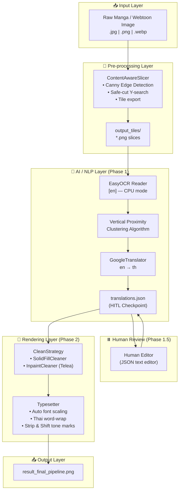
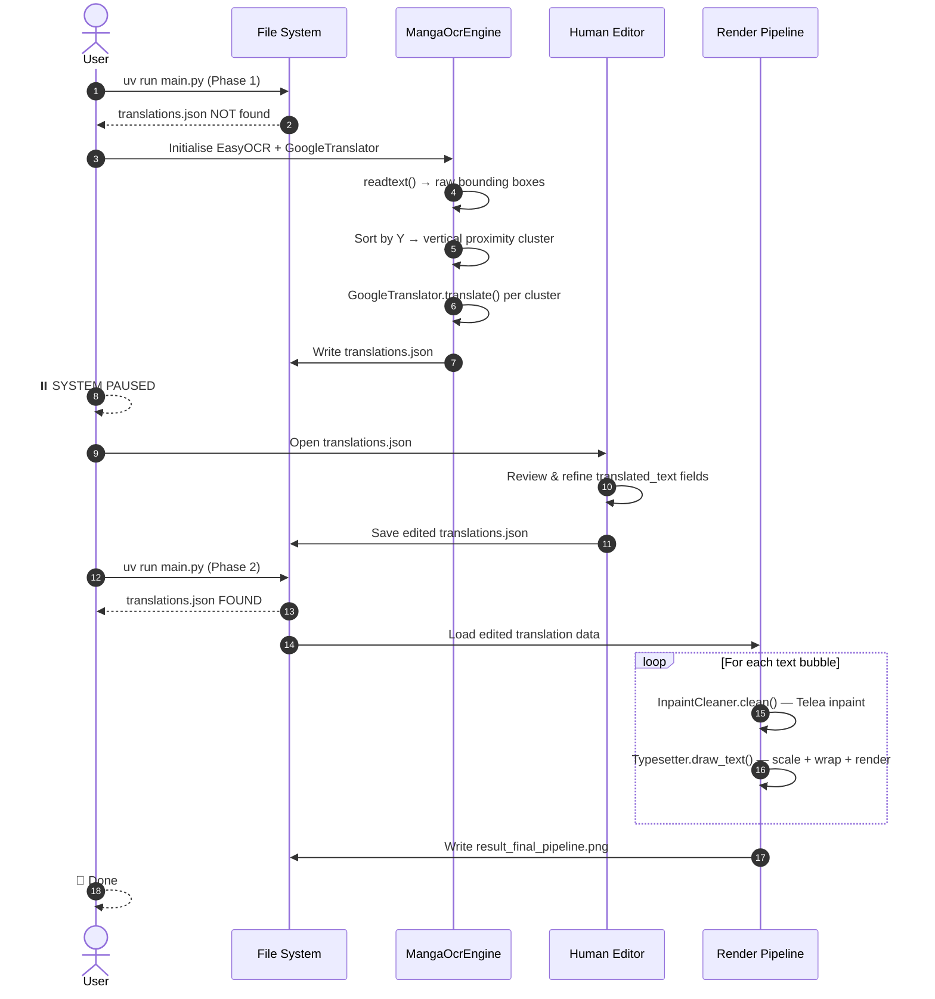
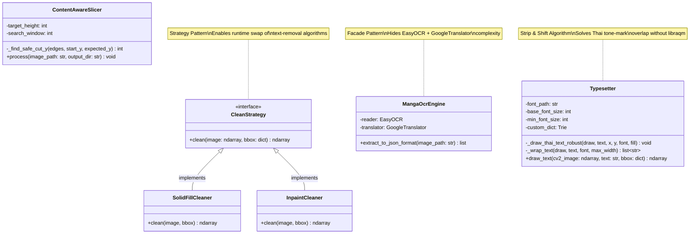
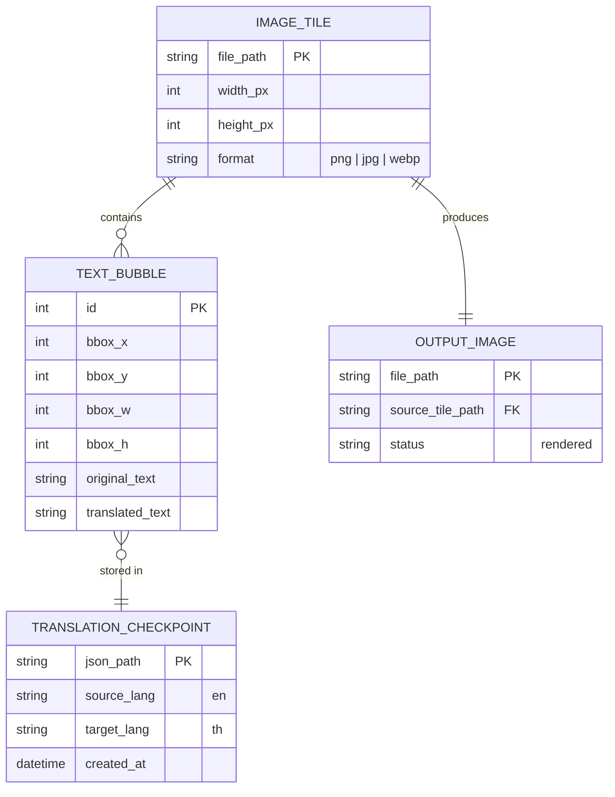
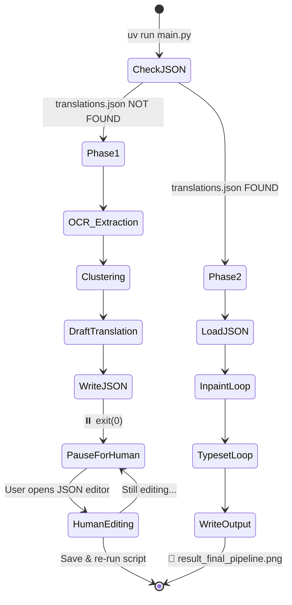
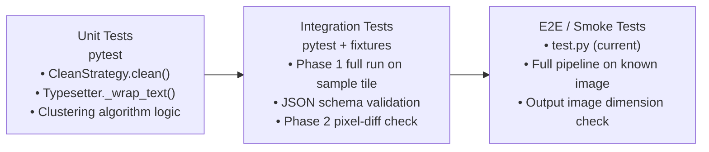

# 💬 Manga Auto-Translator & Smart Thai Typesetter

> **Version:** 1.0.0 · **Python:** 3.13 · **Package Manager:** [uv](https://github.com/astral-sh/uv) · **License:** MIT

An end-to-end, AI-assisted pipeline for translating manga and webtoon images from English to Thai. The system combines **computer vision**, **neural OCR**, **machine translation**, and a custom-built **Thai typesetting algorithm** within a deliberate **Human-in-the-Loop (HITL)** architecture that guarantees translation quality before final rendering.

---

## 📑 Table of Contents

1. [Planning](#1-planning)
2. [Analysis](#2-analysis)
3. [Design](#3-design)
4. [Implementation](#4-implementation)
5. [Testing](#5-testing)
6. [Deployment](#6-deployment)
7. [Maintenance](#7-maintenance)

---

## 1. Planning

### 1.1 Problem Statement

Standard OCR tools read manga/webtoon images line-by-line, fragmenting contextual speech bubbles and producing robotic machine translations that require complete manual re-work. Moreover, rendering Thai text correctly on Windows — particularly handling tone marks (วรรณยุกต์) and upper vowels — requires either the `libraqm` C-library (complex to install) or OS-level shaping support, neither of which is readily available in cross-platform Python environments.

### 1.2 Core Objectives

| # | Objective | Status |
|---|-----------|--------|
| 1 | Slice long webtoon strips into manageable tiles without cutting through dialogue | ✅ Implemented |
| 2 | Cluster OCR text boxes into semantic speech-bubble paragraphs | ✅ Implemented |
| 3 | Generate machine-translated drafts and pause for human review | ✅ Implemented |
| 4 | Erase original text using content-aware inpainting | ✅ Implemented |
| 5 | Render Thai text with correct tone-mark positioning — no external C-libs | ✅ Implemented |
| 6 | Support swappable translation backends (GPT-4o, DeepL, Claude) | 🔄 Extensible |
| 7 | Batch-processing mode for full chapters | 📋 Planned |

### 1.3 Technology Stack Rationale

| Layer | Technology | Rationale |
|-------|------------|-----------|
| **Language** | Python 3.13 | Rich ecosystem for CV, ML, and NLP; rapid prototyping |
| **Package Manager** | `uv` | Significantly faster than pip/poetry; lock-file reproducibility |
| **Computer Vision** | OpenCV (`cv2`) | Industry-standard; Canny edge detection + Telea inpainting |
| **OCR Engine** | EasyOCR ≥ 1.7.2 | GPU-optional; supports multi-language; no Tesseract dependency |
| **Translation** | `deep-translator` ≥ 1.11.4 | Thin wrapper over Google Translate; easily swappable |
| **Thai NLP** | PyThaiNLP ≥ 5.2.0 | Dictionary-based word tokenizer; Trie-accelerated custom vocab |
| **Image Rendering** | Pillow (PIL) | Pixel-precise text drawing; TrueType font control |
| **Numerical** | NumPy | Efficient array ops for edge map row-sum analysis |
| **Font Assets** | THSarabunNew / Sarabun | Full Thai Unicode coverage; OpenType metrics compatible with PIL |

---

## 2. Analysis

### 2.1 Functional Requirements

| ID | Requirement | Implemented In |
|----|-------------|----------------|
| FR-01 | System shall accept webtoon images in PNG, JPG, or WebP format | `ContentAwareSlicer.process()` |
| FR-02 | System shall slice images at content-safe Y-coordinates | `ContentAwareSlicer._find_safe_cut_y()` |
| FR-03 | System shall detect and cluster text bounding boxes into speech bubbles | `MangaOcrEngine.extract_to_json_format()` |
| FR-04 | System shall generate draft translations via Google Translate | `MangaOcrEngine.extract_to_json_format()` |
| FR-05 | System shall serialise extracted data to `translations.json` for human editing | `main.py` — Phase 1 |
| FR-06 | System shall detect a pre-existing `translations.json` and skip OCR on re-run | `main.py` — Phase 2 guard |
| FR-07 | System shall remove original text using one of two pluggable strategies | `SolidFillCleaner`, `InpaintCleaner` |
| FR-08 | System shall render Thai text with auto font-size scaling to fit bounding boxes | `Typesetter.draw_text()` |
| FR-09 | System shall correctly position Thai tone marks relative to upper vowels | `Typesetter._draw_thai_text_robust()` |
| FR-10 | System shall wrap Thai text at word boundaries using a custom NLP dictionary | `Typesetter._wrap_text()` |
| FR-11 | System shall write a final composite image to disk | `main.py` — `result_final_pipeline.png` |

### 2.2 Non-Functional Requirements

| ID | Requirement | Target |
|----|-------------|--------|
| NFR-01 | **Performance** — Phase 1 completes within 45 s on a CPU-only machine (800×15993 px) | ~25–45 s measured |
| NFR-02 | **Performance** — Phase 2 (re-render) completes within 5 s | ~3–5 s measured |
| NFR-03 | **Portability** — No OS-level C-library dependencies for Thai text rendering | `libraqm`-free by design |
| NFR-04 | **Extensibility** — New cleaning or translation strategies require zero changes to the core pipeline | Strategy Pattern enforced |
| NFR-05 | **Reproducibility** — Dependency versions locked via `uv.lock` | `uv.lock` committed |
| NFR-06 | **Correctness** — Thai tone marks rendered at pixel-perfect positions | Strip & Shift Algorithm |

### 2.3 Stakeholders / User Roles

| Role | Description |
|------|-------------|
| **Scanlation Editor** | Primary user; reviews and edits `translations.json` during Phase 1.5 |
| **Pipeline Operator** | Runs `uv run main.py`; configures paths and font settings |
| **Developer / Contributor** | Extends or replaces strategy classes; tunes OCR clustering parameters |

---

## 3. Design

### 3.1 Architectural Style

The system is a **single-module, script-based monolith** structured as a **Layered Pipeline** with three logical tiers:

1. **Pre-processing Layer** — Image slicing (`ContentAwareSlicer`)
2. **AI/NLP Layer** — OCR extraction, text clustering, machine translation (`MangaOcrEngine`)
3. **Rendering Layer** — Text cleaning and Thai typesetting (`CleanStrategy` + `Typesetter`)

The pipeline is bisected by a deliberate **Human-in-the-Loop (HITL) checkpoint** between the AI and Rendering layers, externalising the translation state to `translations.json`.

### 3.2 Design Patterns

| Pattern | Implementation |
|---------|----------------|
| **Strategy (GoF)** | `CleanStrategy` abstract base → `SolidFillCleaner` / `InpaintCleaner` concrete strategies; swap without touching the pipeline |
| **Facade (GoF)** | `MangaOcrEngine` wraps EasyOCR + GoogleTranslator behind a single `extract_to_json_format()` call |
| **Template Method (GoF)** | `Typesetter.draw_text()` defines the rendering skeleton; `_draw_thai_text_robust()` and `_wrap_text()` are the customisable steps |
| **HITL / Human-in-the-Loop** | Pipeline pauses at Phase 1.5, externalising state to a JSON checkpoint file |
| **File-based State Machine** | Presence/absence of `translations.json` acts as a two-state machine controlling pipeline phase |

### 3.3 System Architecture



### 3.4 Two-Phase Data Flow



### 3.5 Class Diagram



### 3.6 Data Model



---

## 4. Implementation

### 4.1 Directory Structure

```
converter-ocr/
├── main.py                  # Monolithic pipeline entry point
├── test.py                  # Manual smoke-test & ContentAwareSlicer runner
├── pyproject.toml           # Project metadata & dependency declarations
├── uv.lock                  # Fully pinned dependency lock file
├── .python-version          # Python 3.13 pin (used by uv)
├── .gitignore               # Excludes tiles, model caches, result images
├── translations.json        # HITL checkpoint — edited by human translators
├── result_final_pipeline.png # Final rendered output (gitignored)
├── OFL.txt                  # SIL Open Font License for bundled fonts
├── fonts/                   # Bundled Thai font assets
│   ├── THSarabunNew Bold.ttf        # Primary rendering font (active)
│   ├── THSarabunNew.ttf
│   ├── Sarabun-*.ttf        # Sarabun family (16 variants)
│   └── ...
├── image/                   # Sample webtoon source images
│   ├── 02-optimized.webp
│   ├── 03.jpg … 07-optimized.webp
├── output_tiles/            # Generated tile sub-directories (gitignored)
│   ├── 02/ 03/ 04/ 05/ 06/ 07/
└── docs/                    # Extended documentation
    ├── README.md            # English user guide
    ├── README_TH.md         # Thai user guide (ภาษาไทย)
    └── main.md              # Full class & method reference (919 lines)
```

### 4.2 Core Modules

#### `ContentAwareSlicer` — Intelligent Image Tiling
Uses the **Canny Edge Detection** algorithm to build a row-wise edge-density map of the full image. For each target cut-point, it searches a configurable window (`±search_window` px) for the row with the **minimum** edge density — meaning the least visual content — and cuts there. This prevents slicing through dialogue or artwork.

#### `MangaOcrEngine` — OCR Facade + Custom Clustering
Wraps EasyOCR's raw bounding-box output with a **vertical proximity clustering algorithm**: bounding boxes whose vertical gap is `< 80 px` AND whose horizontal overlap is `> -50 px` are merged into a single speech-bubble cluster. This lifts the translation unit from individual OCR lines to full paragraphs, significantly improving translation coherence.

#### `CleanStrategy` — Pluggable Text Eraser (Strategy Pattern)
- **`SolidFillCleaner`**: Paints a white rectangle — fast, suitable for solid-background speech bubbles.
- **`InpaintCleaner`**: Uses `cv2.INPAINT_TELEA` (Fast Marching Method, radius=3) to reconstruct the background texture — suitable for text overlaid on artwork.

#### `Typesetter` — AI-Native Thai Rendering Engine
The most technically novel component. It solves three distinct Thai rendering problems without any OS-level library:

1. **Auto Font Scaling**: Iterates from `base_font_size` down to `min_font_size` (step −2) until the wrapped text height fits within `bbox.h × 0.9`.
2. **Thai Word Wrapping**: Uses `PyThaiNLP.word_tokenize(engine="newmm")` with a custom Trie dictionary to tokenise at linguistically correct word boundaries before fitting to width.
3. **Strip & Shift Tone Mark Algorithm**: Separates tone marks (่ ้ ๊ ๋ ์) from the base text string, renders the base first, then repositions each tone mark — shifting **up** (`font.size × 0.12`) if an upper vowel (ั ิ ี ึ ื ํ) precedes it, or **down** (`font.size × 0.15`) otherwise.

### 4.3 HITL State Machine



### 4.4 Performance Benchmarks

| Operation | Input | Time (CPU-only) |
|-----------|-------|-----------------|
| Image Slicing | 800×15993 px → 14 tiles | ~2–3 s |
| OCR Extraction | Per tile | ~15–30 s |
| Machine Translation | All clusters | ~5–10 s |
| Typesetting & Inpainting | Per tile | ~1–2 s |
| **Total — Phase 1** | Full pipeline | **~25–45 s** |
| **Total — Phase 2** | Re-render only | **~3–5 s** |

---

## 5. Testing

### 5.1 Current State

Testing is **partially implemented** via manual smoke-test scripts.

**`test.py`** — Active smoke test for `ContentAwareSlicer`:
```python
from main import ContentAwareSlicer

slicer = ContentAwareSlicer(target_height=1200, search_window=400)
slicer.process(image_path="./image/07-optimized.webp", output_dir="./output_tiles/07")
```

The file also contains a **commented-out** integration test for `InpaintCleaner` + `Typesetter` with mock OCR data — indicating a test-first intent that was deferred.

### 5.2 Intended Testing Strategy

> [!NOTE]
> No automated test framework is currently configured. The following strategy is recommended for future implementation.



**Recommended Framework:** `pytest` with `pytest-cov` for coverage reporting.

**Recommended Test Fixtures:**
- A 200×200 px synthetic test image with white speech bubbles
- A pre-populated `translations_fixture.json` for Phase 2 tests
- `mock.patch` on `easyocr.Reader` and `GoogleTranslator` for offline CI

---

## 6. Deployment

### 6.1 Local Setup

```bash
# 1. Install uv
pip install uv

# 2. Create and activate virtual environment
uv python install 3.13
uv venv --python 3.13
.venv\Scripts\activate        # Windows
# source .venv/bin/activate   # macOS / Linux

# 3. Install all pinned dependencies
uv sync

# 4. Run Phase 1 (OCR + Draft Translation)
uv run main.py
# → Produces translations.json, then pauses

# 5. Edit translations.json manually, then run Phase 2
uv run main.py
# → Produces result_final_pipeline.png
```

> [!IMPORTANT]
> Ensure a Thai TrueType font is present at `./fonts/THSarabunNew Bold.ttf` (included in repo) or update `font_path` in `main.py` accordingly.

### 6.2 Environment Requirements

| Requirement | Minimum | Notes |
|-------------|---------|-------|
| Python | 3.8+ (3.13 pinned) | `.python-version` enforced by `uv` |
| RAM | 4 GB | EasyOCR model load: ~800 MB |
| GPU | Optional | `gpu=False` by default; enable for 3–5× speedup |
| Disk | ~500 MB | EasyOCR model cache (`~/.EasyOCR/`) |
| Network | Required for Phase 1 | Google Translate API calls |

### 6.3 CI/CD Pipeline

> [!NOTE]
> **[To be defined]** — No CI/CD pipeline is currently configured. The following is the recommended setup.


**Recommended tools:** GitHub Actions, `ruff` for linting, `mypy` for type checking.

### 6.4 Docker Containerisation

> **[To be defined / In Progress]** — A `Dockerfile` has not been authored. Key considerations:
> - Base image: `python:3.13-slim`
> - Install `libgl1` for OpenCV headless operation
> - Volume-mount `image/` and `output_tiles/`
> - GPU variant: `nvidia/cuda:12.x-runtime` base for `gpu=True` mode

---

## 7. Maintenance

### 7.1 Scalability Roadmap

| Enhancement | Priority | Effort |
|-------------|----------|--------|
| Batch chapter processing (iterate all tiles automatically) | High | Low |
| Web UI for HITL review (FastAPI + React) | High | High |
| GPU acceleration (`gpu=True` in EasyOCR) | Medium | Low |
| LLM translation backend (GPT-4o / Claude 3.5) | Medium | Medium |
| Multi-language support (Japanese→Thai, Korean→Thai) | Medium | Medium |
| Generative AI inpainting (Stable Diffusion) | Low | High |
| Discord Bot integration for scanlation groups | Low | Medium |

### 7.2 Extending the System

**Swap the Translation Engine:**
```python
class MangaOcrEngine:
    def __init__(self):
        # Replace with any deep-translator-compatible backend
        self.translator = OpenAITranslator(api_key="...")
```

**Add a Custom Cleaning Strategy:**
```python
class GenerativeFillCleaner(CleanStrategy):
    def clean(self, image: np.ndarray, bbox: dict) -> np.ndarray:
        # Integrate Stable Diffusion inpainting here
        return inpainted_image
```

**Extend the PyThaiNLP Dictionary:**
```python
# In Typesetter.__init__()
custom_words.update(["ซันจิ", "โซโร", "นารุโตะ"])  # Character names
```

### 7.3 Known Limitations & Technical Debt

| Item | Description | Recommended Fix |
|------|-------------|-----------------|
| **Single-file Architecture** | All logic resides in `main.py` | Refactor into `src/` package with module separation |
| **Hardcoded Paths** | `target_image_path` and `json_path` are hardcoded in `__main__` | Introduce CLI via `argparse` or `typer` |
| **No Test Suite** | Only manual smoke tests exist | Implement `pytest` suite with fixture images |
| **Synchronous Translation** | Bubbles translated one-by-one via Google API | Switch to async batch requests |
| **Horizontal Clustering** | Proximity clustering is vertical-first; may mis-merge multi-column layouts | Implement 2D spatial clustering |
| **CPU-only Default** | `gpu=False` limits throughput | Auto-detect CUDA availability |

### 7.4 Monitoring

> **[To be defined]** — No performance monitoring is currently in place. Recommended approach: structured logging via Python's `logging` module with per-phase timing metrics written to a `pipeline.log` file.

---

## 📚 Documentation Index

| Document | Language | Description |
|----------|----------|-------------|
| `README.md` *(this file)* | English | SDLC architecture reference |
| [`docs/README.md`](docs/README.md) | English | User quick-start guide |
| [`docs/README_TH.md`](docs/README_TH.md) | ภาษาไทย | Thai user guide |
| [`docs/main.md`](docs/main.md) | English | Full class & method API reference |

---

## 🤝 Contributing

1. Fork the repository
2. Create a feature branch: `git checkout -b feature/your-feature`
3. Commit your changes: `git commit -m 'feat: add your feature'`
4. Push to the branch: `git push origin feature/your-feature`
5. Open a Pull Request

---

## 📄 License

This project is licensed under the **MIT License**.  
Bundled fonts (Sarabun, THSarabunNew) are licensed under the **SIL Open Font License 1.1** — see [`OFL.txt`](OFL.txt).

---

## 🙏 Acknowledgments

- **[EasyOCR](https://github.com/JaidedAI/EasyOCR)** — GPU-optional, multi-language neural OCR
- **[PyThaiNLP](https://github.com/PyThaiNLP/pythainlp)** — Thai NLP toolkit and tokeniser
- **[OpenCV](https://opencv.org/)** — Computer vision and Telea inpainting
- **[Pillow](https://python-pillow.org/)** — TrueType font rendering
- **[deep-translator](https://github.com/nidhaloff/deep-translator)** — Translation API abstraction

---

*Last Updated: 2026-04-27 · Maintained by the TaiChi112 team*
