```mermaid
sequenceDiagram
    participant T as Input Text
    participant S as Strip Algorithm
    participant B as Base Text
    participant M as Tone Mark Renderer
    participant O as Output
    
    T->>S: "กิ่น" (with tone marks)
    S->>S: Detect upper vowels (ิ)
    S->>S: Detect tone marks (่)
    S->>B: "กิน" (base only)
    B->>M: Draw base text first
    M->>M: Calculate tone position
    M->>M: Shift UP if vowel present
    M->>M: Shift DOWN if no vowel
    M->>O: Perfect rendering
    
    note over M: shift_up = font.size * 0.12<br/>shift_down = font.size * 0.15
```

# 📘 main.py - Technical Documentation

Complete technical reference for the Manga Auto-Translator pipeline. This document explains the architecture, classes, methods, and workflow of the entire system.

---

## 📑 Table of Contents

- [Architecture Overview](#architecture-overview)
- [Class Reference](#class-reference)
  - [1. Image Processing & Cleaning](#1-image-processing--cleaning)
  - [2. OCR & Translation Engine](#2-ocr--translation-engine)
  - [3. Typesetter Engine](#3-typesetter-engine)
- [Workflow Diagrams](#workflow-diagrams)
- [Usage Examples](#usage-examples)
- [Advanced Customization](#advanced-customization)

---

## 🏗️ Architecture Overview

The system follows **Strategy Pattern** and **Human-in-the-Loop (HITL)** design principles:


### 🔑 Key Components

| Component              | Responsibility                           | Pattern          |
| ---------------------- | ---------------------------------------- | ---------------- |
| **ContentAwareSlicer** | Splits long images intelligently         | Algorithm        |
| **CleanStrategy**      | Removes original text                    | Strategy Pattern |
| **MangaOcrEngine**     | Extracts and translates text             | Facade           |
| **Typesetter**         | Renders Thai text with proper formatting | Template Method  |

---

## 📚 Class Reference

### 1. Image Processing & Cleaning

#### 🔹 `CleanStrategy` (Abstract Base Class)

**Purpose:** Interface for text removal strategies.

```python
class CleanStrategy:
    def clean(self, image, bbox):
        """
        Remove text from specified bounding box.
        
        Args:
            image (numpy.ndarray): Input image in BGR format
            bbox (dict): Bounding box with keys: x, y, w, h
        
        Returns:
            numpy.ndarray: Cleaned image
        """
        pass
```

---

#### 🔹 `SolidFillCleaner` (Concrete Strategy)

**Purpose:** Simple white rectangle fill to erase text.

**When to use:**
- ✅ Speech bubbles with solid white background
- ✅ Simple flat backgrounds
- ❌ Complex textured backgrounds (will look unnatural)

**Example:**
```python
from PIL import Image
import cv2

# Load image
img = cv2.imread("manga_page.png")

# Define text region
bbox = {"x": 100, "y": 50, "w": 200, "h": 30}

# Apply cleaning
cleaner = SolidFillCleaner()
cleaned_img = cleaner.clean(img.copy(), bbox)

cv2.imwrite("cleaned_output.png", cleaned_img)
```

**Algorithm:**


---

#### 🔹 `InpaintCleaner` (Concrete Strategy)

**Purpose:** AI-powered content-aware fill using OpenCV Telea algorithm.

**When to use:**
- ✅ Text over artwork/backgrounds
- ✅ Complex textures
- ✅ Gradients and patterns
- ⚠️ Slower than SolidFillCleaner

**Example:**
```python
cleaner = InpaintCleaner()
cleaned_img = cleaner.clean(img.copy(), bbox)

# The algorithm intelligently reconstructs 
# the background based on surrounding pixels
```

**Algorithm:**


**Parameters:**
- `inpaintRadius=3`: Neighborhood size for reconstruction (higher = smoother but slower)
- `flags=cv2.INPAINT_TELEA`: Fast marching method (alternative: `INPAINT_NS` for Navier-Stokes)

---

#### 🔹 `ContentAwareSlicer`

**Purpose:** Intelligently splits long webtoon/manhwa images into processable tiles without cutting through text.

**Constructor:**
```python
ContentAwareSlicer(target_height=1500, search_window=300)
```

**Parameters:**
- `target_height` (int): Desired tile height in pixels (default: 1500)
- `search_window` (int): Search radius for safe cut points (default: ±300px)

**Methods:**

##### `_find_safe_cut_y(edges_image, start_y, expected_y)`
Private method to locate the optimal Y-coordinate for cutting.

**Algorithm:**


**Example:**
```python
import cv2
import numpy as np

slicer = ContentAwareSlicer(target_height=1200, search_window=400)

# Convert to grayscale and detect edges
gray = cv2.cvtColor(img, cv2.COLOR_BGR2GRAY)
edges = cv2.Canny(gray, 50, 150)

# Find safe cut at around Y=1200 ± 400
safe_y = slicer._find_safe_cut_y(edges, start_y=0, expected_y=1200)
print(f"Safe cut point: Y={safe_y}")  # e.g., Y=1058 (blank space detected)
```

##### `process(image_path, output_dir)`
Main slicing pipeline.

**Parameters:**
- `image_path` (str): Path to input webtoon image
- `output_dir` (str): Folder to save tiles

**Example:**
```python
slicer = ContentAwareSlicer(target_height=1500, search_window=300)
slicer.process("./webtoon_chapter1.png", "./output_tiles/")

# Output:
# ./output_tiles/webtoon_chapter1_001.png
# ./output_tiles/webtoon_chapter1_002.png
# ./output_tiles/webtoon_chapter1_003.png
```

**Process Flow:**


---

### 2. OCR & Translation Engine

#### 🔹 `MangaOcrEngine`

**Purpose:** Phase 1 pipeline - Extract text using OCR, cluster into paragraphs, and generate draft translations.

**Constructor:**
```python
MangaOcrEngine()
```

**Initialization:**
```python
# Loads EasyOCR model (English) - GPU disabled for compatibility
self.reader = easyocr.Reader(["en"], gpu=False)

# Loads Google Translate API
self.translator = GoogleTranslator(source="en", target="th")
```

**Methods:**

##### `extract_to_json_format(image_path)`

**Purpose:** Complete OCR → Clustering → Translation pipeline.

**Returns:** 
```python
[
    {
        "id": 1,
        "box": {"x": 100, "y": 50, "w": 200, "h": 40},
        "original_text": "Hello World",
        "translated_text": "สวัสดีชาวโลก"
    },
    ...
]
```

**Example:**
```python
engine = MangaOcrEngine()
data = engine.extract_to_json_format("./manga_page.png")

import json
with open("translations.json", "w", encoding="utf-8") as f:
    json.dump(data, f, ensure_ascii=False, indent=4)
```

**Clustering Algorithm:**

The engine uses **custom vertical proximity clustering** to merge related text boxes:


**Algorithm Details:**
```python
# Two boxes are merged if:
# 1. Vertical gap < 80 pixels
vertical_gap = box["y"] - (last["y"] + last["h"])

# 2. Horizontal overlap > -50 pixels (allows slight misalignment)
horizontal_overlap = max(0, 
    min(last["x"] + last["w"], box["x"] + box["w"]) - 
    max(last["x"], box["x"])
)

if vertical_gap < 80 and horizontal_overlap > -50:
    # MERGE: Extend bounding box and concatenate text
    merge_boxes(last, box)
else:
    # CREATE NEW CLUSTER
    bubbles.append(box)
```

**Customization Example:**
```python
# For manga with very compact text (e.g., chibi speech bubbles):
vertical_gap < 50  # Reduce threshold

# For webtoon with sparse dialogue:
vertical_gap < 120  # Increase threshold
```

---

### 3. Typesetter Engine

#### 🔹 `Typesetter`

**Purpose:** Phase 2 pipeline - Render Thai text with intelligent font scaling, word wrapping, and tone mark positioning.

**Constructor:**
```python
Typesetter(font_path=None, base_font_size=28, min_font_size=14)
```

**Parameters:**
- `font_path` (str): Path to Thai TrueType font (e.g., `"THSarabunNew Bold.ttf"`)
- `base_font_size` (int): Starting font size (auto-scales down if needed)
- `min_font_size` (int): Minimum allowed font size

**Initialization:**
```python
# Custom Thai dictionary for accurate word tokenization
custom_words = set(thai_words())
custom_words.update(["บอกว่า", "ดีแล้ว", "เกินจริง"])

# Remove problematic short words
if "บอ" in custom_words:
    custom_words.remove("บอ")

self.custom_dict = dict_trie(custom_words)
```

---

**Methods:**

##### `_draw_thai_text_robust(draw, text, x, y, font, fill)`

**Purpose:** Solves the notorious **Thai tone mark overlap** issue on Windows.

**The Problem:**
```
Normal rendering: ป็  (tone mark overlaps vowel)
Correct rendering: ป ็ (tone mark shifted up)
```

**Algorithm:**


**Example:**
```python
from PIL import Image, ImageDraw, ImageFont

img = Image.new("RGB", (500, 200), color="white")
draw = ImageDraw.Draw(img)
font = ImageFont.truetype("tahoma.ttf", size=48)

typesetter = Typesetter()
typesetter._draw_thai_text_robust(
    draw, 
    text="กิ่น", 
    x=50, 
    y=50, 
    font=font, 
    fill=(0, 0, 0)
)

img.save("thai_text_perfect.png")
```

**Character Sets:**
```python
# Upper vowels that require tone mark shift
upper_vowels = ["\u0e31", "\u0e34", "\u0e35", "\u0e36", "\u0e37", "\u0e4d"]
# ◌ั  ◌ิ  ◌ี  ◌ึ  ◌ื  ◌ํ

# Tone marks to be repositioned
tone_marks = ["\u0e48", "\u0e49", "\u0e4a", "\u0e4b", "\u0e4c"]
# ่  ้  ๊  ๋  ์
```

---

##### `_wrap_text(draw, text, font, max_width)`

**Purpose:** Thai-aware word wrapping using PyThaiNLP dictionary.

**Algorithm:**


**Example:**
```python
typesetter = Typesetter(font_path="tahoma.ttf")
draw = ImageDraw.Draw(Image.new("RGB", (400, 400), "white"))
font = ImageFont.truetype("tahoma.ttf", size=24)

text = "ผมชอบอ่านการ์ตูนญี่ปุ่นมากเพราะว่ามันสนุกและมีเนื้อหาดี"
lines = typesetter._wrap_text(draw, text, font, max_width=350)

print(lines)
# Output:
# ['ผมชอบอ่านการ์ตูนญี่ปุ่น',
#  'มากเพราะว่ามันสนุกและ',
#  'มีเนื้อหาดี']
```

**Customization:**
```python
# Add character names to prevent splitting
custom_words = set(thai_words())
custom_words.update([
    "ซันจิ",     # Sanji
    "โซโร",      # Zoro
    "นารุโตะ"    # Naruto
])
```

---

##### `draw_text(cv2_image, text, bbox)`

**Purpose:** Main rendering pipeline with auto font scaling.

**Parameters:**
- `cv2_image` (numpy.ndarray): Input image (BGR format)
- `text` (str): Thai text to render
- `bbox` (dict): Bounding box with keys `x`, `y`, `w`, `h`

**Returns:** 
- `numpy.ndarray`: Image with rendered text (BGR format)

**Example:**
```python
import cv2

img = cv2.imread("cleaned_bubble.png")
bbox = {"x": 100, "y": 50, "w": 300, "h": 80}

typesetter = Typesetter(font_path="THSarabunNew Bold.ttf", base_font_size=32)
result = typesetter.draw_text(img, "สวัสดีครับ ยินดีต้อนรับ", bbox)

cv2.imwrite("final_output.png", result)
```

**Auto-Scaling Algorithm:**


**Process Flow:**
```python
# 1. Image format conversion
pil_image = Image.fromarray(cv2.cvtColor(cv2_image, cv2.COLOR_BGR2RGB))

# 2. Font scaling loop
current_size = base_font_size
while current_size >= min_font_size:
    lines = wrap_text(text, font, max_width=w*0.9)
    if total_height <= h*0.9:
        break
    current_size -= 2

# 3. Center alignment
for line in lines:
    line_x = x + (w - line_width) / 2
    line_y = y + vertical_offset
    
    # 4. Render with tone mark correction
    _draw_thai_text_robust(...)
    
    vertical_offset += line_height

# 5. Convert back to OpenCV format
return cv2.cvtColor(numpy_image, cv2.COLOR_RGB2BGR)
```

---

## 📊 Workflow Diagrams

### Complete HITL Pipeline

```mermaid
sequenceDiagram
    autonumber
    participant U as User
    participant S as System
    participant OCR as MangaOcrEngine
    participant F as File System
    participant H as Human Editor
    participant TS as Typesetter
    
    U->>S: Run main.py (Phase 1)
    S->>S: Check if translations.json exists
    S-->>F: Not found
    S->>OCR: Initialize EasyOCR + GoogleTranslator
    OCR->>OCR: Scan image for text boxes
    OCR->>OCR: Cluster nearby boxes
    OCR->>OCR: Translate each cluster
    OCR->>F: Write translations.json
    S->>U: ⏸️ PAUSE for human review
    
    U->>H: Open translations.json in editor
    H->>H: Review & edit translations
    H->>F: Save edited translations.json
    
    U->>S: Run main.py (Phase 2)
    S->>S: Check if translations.json exists
    S-->>F: Found!
    S->>F: Load edited translations
    loop For each text box
        S->>S: Clean text area (InpaintCleaner)
        S->>TS: Render Thai text
        TS->>TS: Auto-scale font
        TS->>TS: Word wrap with PyThaiNLP
        TS->>TS: Draw with tone mark shifting
    end
    S->>F: Write result_final_pipeline.png
    S->>U: 🎉 Done!
```



---

### Class Diagram


---

## 💻 Usage Examples

### Example 1: Simple Pipeline (Test Image)

```python
import cv2
import os
from main import *

# Create test image
os.makedirs("./output_tiles", exist_ok=True)
test_img = cv2.imread("./output_tiles/test_tile.png")

# Mock data from OCR
mock_data = [
    {
        "id": 1,
        "box": {"x": 90, "y": 120, "w": 250, "h": 50},
        "original_text": "MISSION #1",
        "translated_text": "ภารกิจที่ 1"
    }
]

# Processing
cleaner = InpaintCleaner()
typesetter = Typesetter(font_path="./THSarabunNew Bold.ttf")

result = test_img.copy()
for item in mock_data:
    result = cleaner.clean(result, item["box"])
    result = typesetter.draw_text(result, item["translated_text"], item["box"])

cv2.imwrite("result.png", result)
```

---

### Example 2: Content-Aware Slicing

```python
slicer = ContentAwareSlicer(
    target_height=1200,  # Slice every ~1200px
    search_window=400     # Allow ±400px flexibility
)

slicer.process(
    image_path="./image/long_webtoon.png",
    output_dir="./output_tiles/"
)

# Output:
# ./output_tiles/long_webtoon_001.png (Y: 0 → 1058)
# ./output_tiles/long_webtoon_002.png (Y: 1058 → 2370)
# ./output_tiles/long_webtoon_003.png (Y: 2370 → 3951)
# ... and so on
```

---

### Example 3: Full HITL Workflow

```python
import json

# -----------------------------
# PHASE 1: Extraction
# -----------------------------
if not os.path.exists("translations.json"):
    print("Starting Phase 1...")
    
    engine = MangaOcrEngine()
    data = engine.extract_to_json_format("./manga_page.png")
    
    with open("translations.json", "w", encoding="utf-8") as f:
        json.dump(data, f, ensure_ascii=False, indent=4)
    
    print("⏸️ PAUSE: Please edit translations.json manually")
    exit(0)

# -----------------------------
# PHASE 2: Rendering
# -----------------------------
else:
    print("Starting Phase 2...")
    
    with open("translations.json", "r", encoding="utf-8") as f:
        edited_data = json.load(f)
    
    img = cv2.imread("./manga_page.png")
    cleaner = InpaintCleaner()
    typesetter = Typesetter(font_path="tahoma.ttf", base_font_size=28)
    
    for item in edited_data:
        img = cleaner.clean(img, item["box"])
        img = typesetter.draw_text(img, item["translated_text"], item["box"])
    
    cv2.imwrite("final_result.png", img)
    print("✅ Done!")
```

---

### Example 4: Custom Cleaner Strategy

```python
class GaussianBlurCleaner(CleanStrategy):
    """Custom cleaner: Blur instead of removing"""
    
    def clean(self, image, bbox):
        x, y, w, h = bbox["x"], bbox["y"], bbox["w"], bbox["h"]
        
        # Extract region
        roi = image[y:y+h, x:x+w]
        
        # Apply strong Gaussian blur
        blurred = cv2.GaussianBlur(roi, (51, 51), 0)
        
        # Put back
        image[y:y+h, x:x+w] = blurred
        return image

# Usage
cleaner = GaussianBlurCleaner()
result = cleaner.clean(img, bbox)
```

---

### Example 5: Batch Processing

```python
import glob

# Process all tiles in a folder
tile_paths = glob.glob("./output_tiles/*.png")
typesetter = Typesetter(font_path="THSarabunNew Bold.ttf")

for tile_path in tile_paths:
    # Load corresponding JSON
    json_path = tile_path.replace(".png", ".json")
    
    if not os.path.exists(json_path):
        continue
    
    with open(json_path, "r", encoding="utf-8") as f:
        data = json.load(f)
    
    # Process
    img = cv2.imread(tile_path)
    for item in data:
        img = typesetter.draw_text(img, item["translated_text"], item["box"])
    
    # Save
    output_path = tile_path.replace("output_tiles", "final_tiles")
    cv2.imwrite(output_path, img)
    print(f"✓ Processed: {tile_path}")
```

---

## 🔧 Advanced Customization

### Tuning OCR Clustering

**Scenario:** Speech bubbles are being merged incorrectly.

```python
# In MangaOcrEngine.extract_to_json_format()

# BEFORE (too aggressive):
if vertical_gap < 80 and horizontal_overlap > -50:
    merge_boxes()

# AFTER (more conservative):
if vertical_gap < 50 and horizontal_overlap > 20:
    merge_boxes()
```

---

### Custom Font Size Rules

**Scenario:** Want larger fonts for short text, smaller for long text.

```python
class SmartTypesetter(Typesetter):
    def draw_text(self, cv2_image, text, bbox):
        # Adjust base size by text length
        if len(text) < 10:
            self.base_font_size = 36  # Large for short text
        elif len(text) < 30:
            self.base_font_size = 28  # Medium
        else:
            self.base_font_size = 20  # Small for long text
        
        return super().draw_text(cv2_image, text, bbox)
```

---

### Adding OCR Language Support

**Scenario:** Manga has both English and Japanese.

```python
class MultilingualOcrEngine(MangaOcrEngine):
    def __init__(self):
        print("Loading multilingual OCR...")
        self.reader = easyocr.Reader(["en", "ja"], gpu=True)  # Add Japanese
        self.translator = GoogleTranslator(source="auto", target="th")
```

---

### Performance Optimization

**Scenario:** Processing is too slow.

```python
# Enable GPU for EasyOCR (if CUDA available)
self.reader = easyocr.Reader(["en"], gpu=True)

# Use batch translation
def translate_batch(self, texts):
    return [self.translator.translate(t) for t in texts]

# Cache font objects
from functools import lru_cache

@lru_cache(maxsize=10)
def get_font(self, size):
    return ImageFont.truetype(self.font_path, size=size)
```

---

## 🎯 Conclusion

This documentation covers the complete technical architecture of `main.py`. Key takeaways:

1. **Strategy Pattern** enables flexible text removal methods
2. **Content-Aware Slicing** prevents cutting through dialogue
3. **Custom OCR Clustering** improves translation context
4. **Thai Tone Mark Algorithm** solves Windows rendering issues
5. **HITL Workflow** ensures translation quality

For higher-level usage instructions, see:
- [README.md](../README.md) - Quick start guide
- [docs/README.md](README.md) - Full documentation (English)
- [docs/README_TH.md](README_TH.md) - Full documentation (Thai)

---

**Last Updated:** February 24, 2026  
**Version:** 1.0.0  
**License:** MIT
